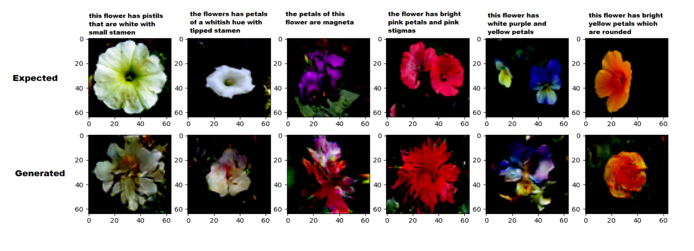
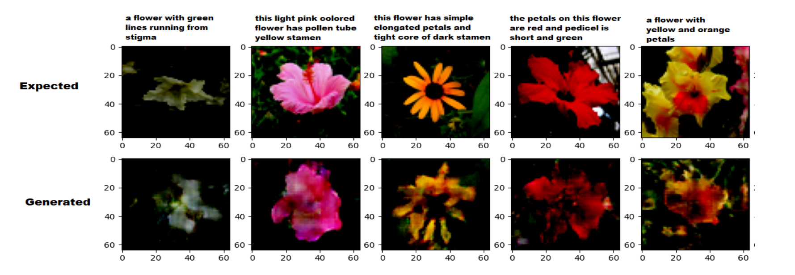

## TEXT to IMAGE Generation
The project aims to employ Generative Adversarial Neural Networks (GANs) trained on Oxford Flower Dataset to generate real-life images of flowers from textual description. Code can be used for training model from scratch/ contact for pretrained models. 
Models are implemented in PyTorch and they have theoritical outline in [Radford et al.](https://arxiv.org/abs/1511.06434) and [Reed et al.](https://arxiv.org/abs/1605.05396) work. These models utilize pretrained text embeddings for contextual encoder from the work of [reedscot/icml2016](https://github.com/reedscot/icml2016).
 
- Models were trained for 100 epochs. 
- Textual embedding of 1024 dims is mapped to 64x64 Px Image. 
- To prevent the overfitting of L1 & L2 regualarization were applied during training loop.
### Results
#### DCGAN

#### DCGAN-CLS-INT

Report: [HERE](../main/Baseline/Report.pdf)

